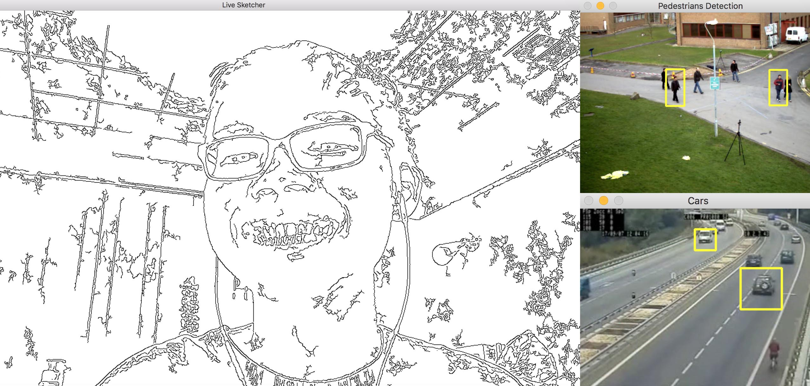

<p align = "center">
    
</p>

<br>

During winter break of 2016, I self taught myself openCV and various Computer Vision concepts. I learn best by doing projects so this repo contains all of my practices and mini projects with openCV 3.0 and python 3.5.

## Install
Python3.5 and OpenCV 3

Setting up openCV 3 with Python3.5 on MacOS is much complicated than I expected.
Please follow the exact steps of this guide to successfull install everything:

```
http://www.pyimagesearch.com/2016/12/05/macos-install-opencv-3-and-python-3-5/
```

## Usage
```
python3 filename.py
```
<br>
For example:
```
cd 00-projects/
python3 live_sketch_using_webcam.py

```

## License

MIT © [Nhan Tran](http://trannhan.com)